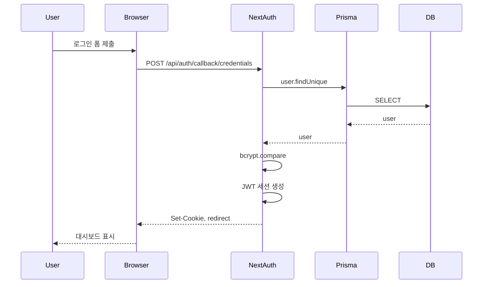
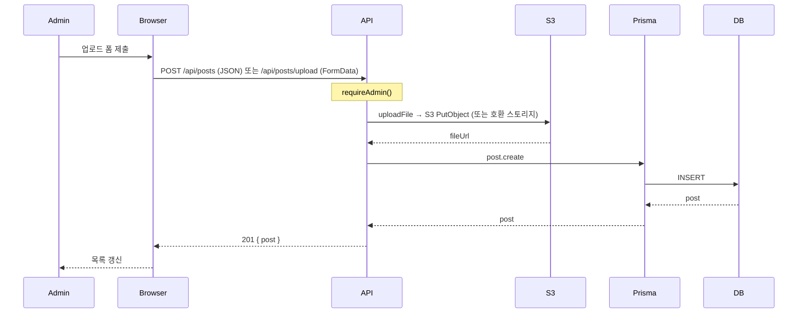
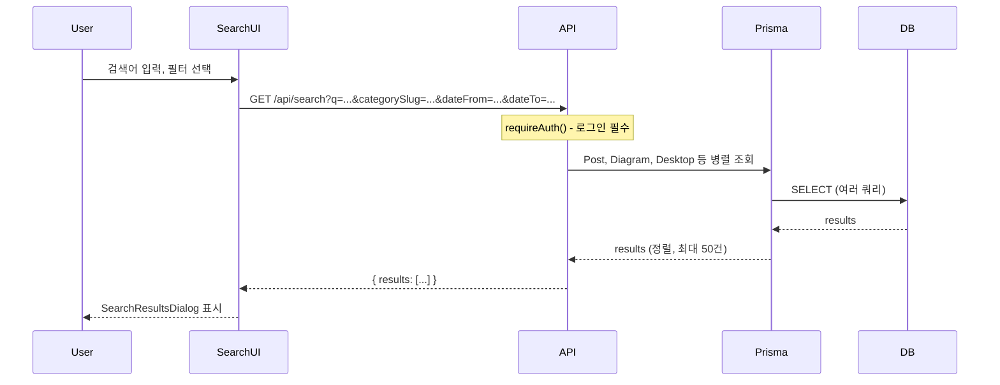
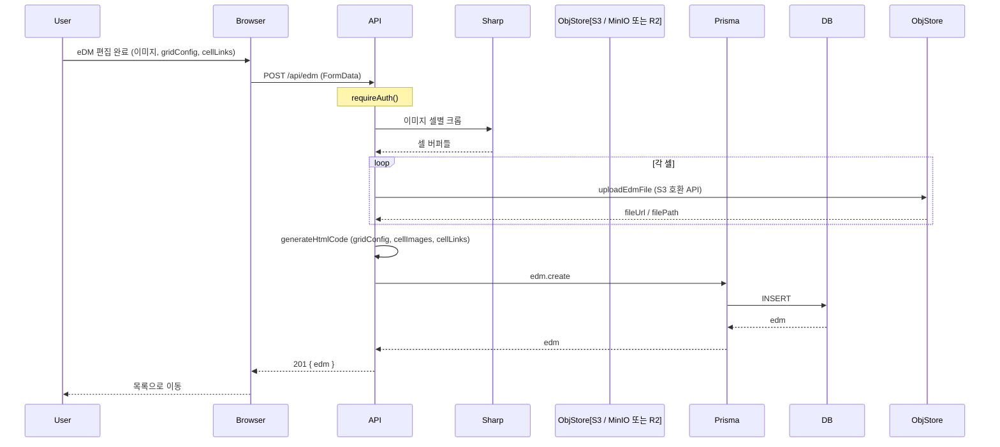

# 데이터 플로우 다이어그램

사용자 액션에 따른 데이터 흐름을 시퀀스 다이어그램으로 표현합니다.

---

## 1. 로그인 (Credentials)

이메일/비밀번호 로그인 시 흐름입니다. NextAuth JWT 전략 사용.

- **인증**: 없음 (로그인 전)
- **엔드포인트**: `/api/auth/[...nextauth]` (NextAuth)

---

## 2. 게시물 업로드

관리자가 게시물(이미지)을 업로드하는 흐름입니다.

- **인증**: ADMIN 역할 필수
- **엔드포인트**: `POST /api/posts`, `POST /api/posts/upload` 등
- **객체 URL**: `S3_PUBLIC_BASE_URL` 등으로 공개 URL이 잡히면 DB에 해당 URL이 저장됩니다. 레거시 Worker·B2 형식 URL이 DB에 남아 있을 수 있습니다.
- **Presigned 업로드**: 일부 카테고리는 `/api/posts/upload-presigned`로 받은 URL에 **브라우저 PUT**으로 직접 올립니다. MinIO/S3 **CORS**에 앱 오리진이 필요합니다.

---

## 3. 통합 검색

Header 검색창에서 Post, Diagram, Desktop, Card, WelcomeBoard를 통합 검색하는 흐름입니다.

- **인증**: 로그인 필수
- **엔드포인트**: `GET /api/search`

---

## 4. eDM 생성

이미지 업로드 후 그리드 분할, 셀 이미지 추출, HTML 생성까지의 흐름입니다.

- **인증**: 로그인 필수
- **엔드포인트**: `POST /api/edm`
- **스토리지**: `lib/r2-edm-storage.ts` — **`S3_*`(MinIO) edms** 버킷만. 공개 URL은 `S3_PUBLIC_BASE_URL`(+ `NEXT_PUBLIC_S3_PUBLIC_BASE_URL` 클라이언트) 설정 시.

---

## 5. 주기 작업·백업

- **퍼블릿 배포(Vercel 등)**: GitHub Actions `keepalive.yml`이 `APP_URL/api/keepalive`를 호출할 수 있습니다. [KEEPALIVE_SETUP.md](KEEPALIVE_SETUP.md) 참조.
- **사내망**: GitHub가 앱 URL에 닿지 않으면 **서버 `cron`**으로 동일 API를 호출하는 편이 낫습니다. DB 백업은 `pg_dump` + (선택) MinIO 백업 버킷. [`deploy/rocky/README.md`](../deploy/rocky/README.md)「사내망 운영」.
- **레거시 워크플로**: `.github/workflows/backup-supabase-to-b2.yml` 등은 클라우드 Supabase+B2 전제이며, 사내망 전용이면 비활성화하고 사내 절차로 대체합니다.
