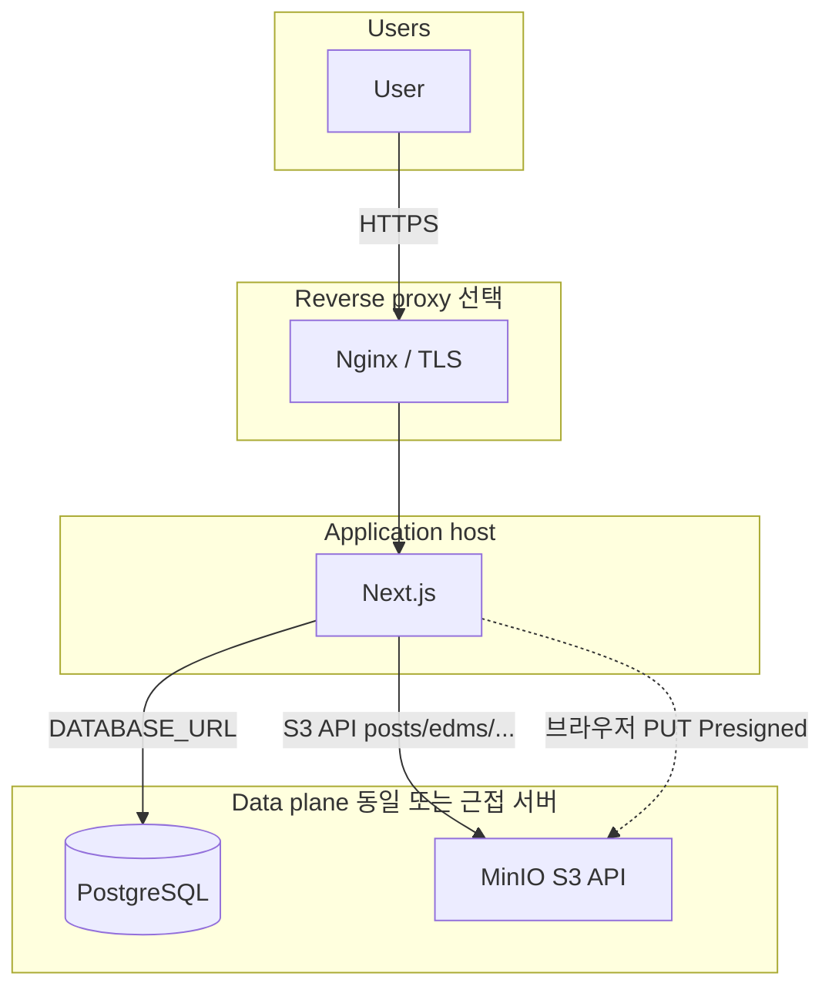
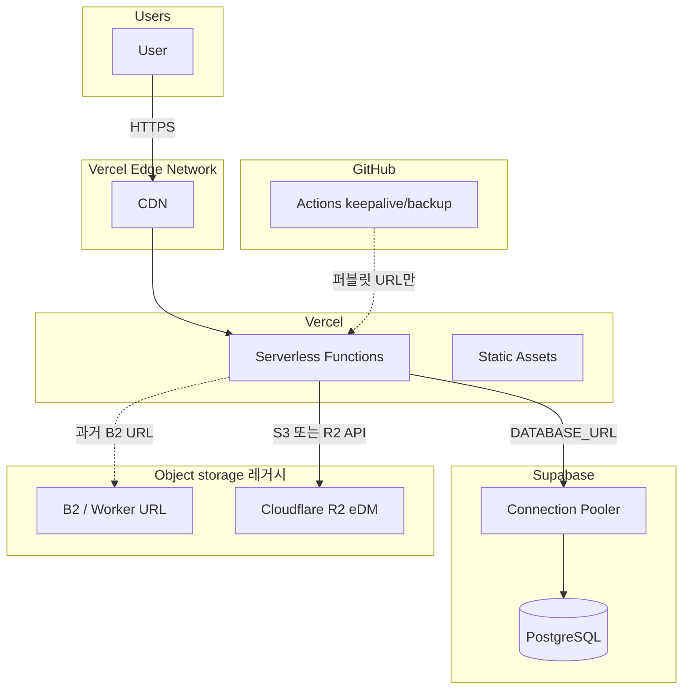
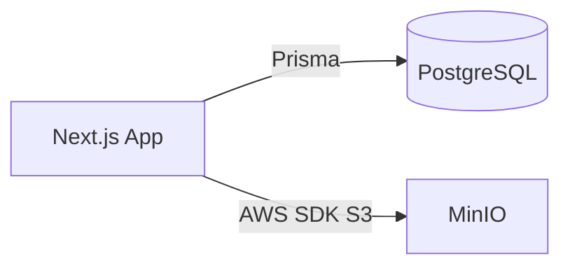

# 인프라 다이어그램

배포 환경의 물리적·논리적 구조를 표현합니다. **사내망(옵션 B)** 을 기본으로 하고, 클라우드 구성은 레거시 참고용으로 정리합니다.

---

## 사내망 배포 (권장)

PostgreSQL + MinIO(S3 호환) + Next.js(자체 호스팅) + (선택) Nginx.

| 구성요소 | 설명 | 환경 변수(요지) |
|----------|------|-------------------|
| **PostgreSQL** | Prisma·NextAuth 세션 등 | `DATABASE_URL`, `DIRECT_URL` |
| **MinIO** | 게시물·eDM·아바타·아이콘 등 S3 버킷 | `S3_ENDPOINT`, `S3_ACCESS_KEY_ID`, `S3_SECRET_ACCESS_KEY`, `S3_BUCKET_*`, `S3_PUBLIC_BASE_URL` |
| **Next.js** | API·SSR·정적 자원 | `NEXTAUTH_URL`, `NEXTAUTH_SECRET` |
| **Nginx** | TLS 종료, `client_max_body_size`, `X-Forwarded-Proto` | 호스트 설정 |

- **Rocky 예시**: [`deploy/rocky/docker-compose.yml`](../deploy/rocky/docker-compose.yml) — Postgres + MinIO. Next는 같은 호스트의 프로세스/Docker 또는 별도 배포.
- **디렉터리**: [`deploy/WEBAPPS_LAYOUT.md`](../deploy/WEBAPPS_LAYOUT.md)

---

## 클라우드 배포 (레거시 참고)

Vercel + Supabase + B2/R2를 쓰던 시기의 연결 관계입니다. 현재 코드는 **S3_* 우선**이며 Backblaze B2 npm SDK는 제거되었습니다.

| 구성요소 | 비고 |
|----------|------|
| **Supabase** | 호스티드 Postgres + (선택) Storage REST — 사내망 전환 시 자체 Postgres로 대체 |
| **R2** | eDM용. `S3_*` 설정 시 동일 SDK로 MinIO `edms` 버킷 사용 |
| **GitHub Actions** | 퍼블릿 `APP_URL` 전제. 사내망 전용 URL이면 비활성·사내 cron 권장 |

---

## 환경 변수 연결 관계 (사내망)

---

## 관련 문서

- [DEPLOYMENT.md](DEPLOYMENT.md) — 배포 가이드
- [KEEPALIVE_SETUP.md](KEEPALIVE_SETUP.md) — Keepalive(GitHub·사내 cron)
- [Mermaid Live Editor](https://mermaid.live) — 다이어그램 편집
