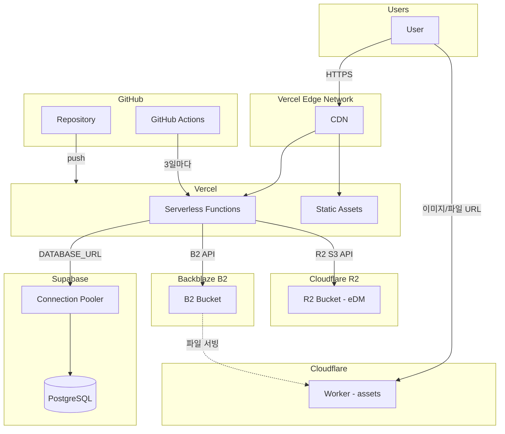
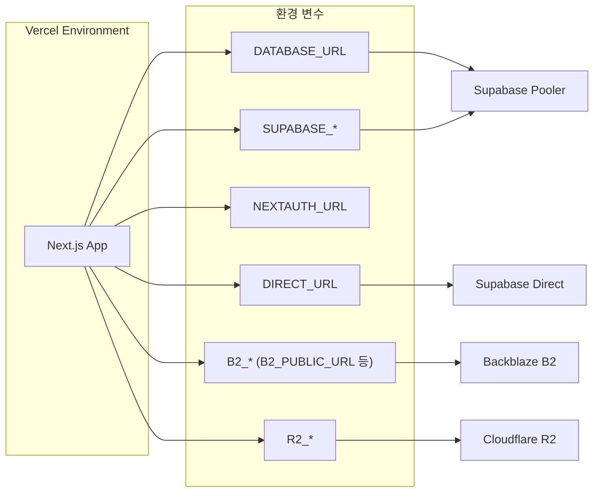

# 인프라 다이어그램

배포 환경의 물리적/논리적 구조를 표현합니다. Vercel, Supabase, Backblaze B2, Cloudflare R2, GitHub가 실제로 어떻게 연결되는지 보여줍니다.

## 인프라 개요

## 구성 요소별 설명

### Vercel

| 구성요소 | 설명 |
|----------|------|
| **CDN (Edge Network)** | 전 세계 엣지에서 정적 에셋 및 이미지 최적화 제공 |
| **Serverless Functions** | Next.js API Routes, Server Components가 실행되는 런타임 |
| **Static Assets** | `public/`, 빌드 결과물 등 정적 파일 |

- **배포**: GitHub push 시 자동 빌드·배포
- **빌드 명령**: `prisma migrate deploy && next build`

### Supabase

| 구성요소 | 설명 | 환경 변수 |
|----------|------|------------|
| **Connection Pooler** | Session 모드 연결 풀. Prisma용 | `DATABASE_URL` (connection_limit=1 권장) |
| **PostgreSQL** | 메인 DB. 마이그레이션은 Direct 연결 사용 | `DIRECT_URL` |

- **참고**: eDM 셀 이미지는 Supabase Storage가 아닌 **Cloudflare R2**에 저장됩니다.

### Backblaze B2

| 구성요소 | 설명 | 환경 변수 |
|----------|------|------------|
| **B2 Bucket** | 게시물 이미지, 다이어그램 썸네일, PPT ZIP, 가이드 영상 등 | `B2_APPLICATION_KEY_ID`, `B2_APPLICATION_KEY`, `B2_BUCKET_ID`, `B2_BUCKET_NAME`, `B2_ENDPOINT` |

- **Cloudflare Worker (선택)**: Private 버킷일 경우 Cloudflare Worker를 두고 공개 URL(예: https://assets.layerary.com)로 파일을 서빙할 수 있습니다. 이때 `B2_PUBLIC_URL`, `NEXT_PUBLIC_B2_PUBLIC_URL`을 Worker 도메인으로 설정합니다.

### Cloudflare R2

| 구성요소 | 설명 | 환경 변수 |
|----------|------|------------|
| **R2 Bucket (eDM)** | eDM 셀 이미지·썸네일 저장. S3 호환 API 사용. 공개 URL 또는 Presigned URL 제공 | `R2_ACCOUNT_ID`, `R2_ACCESS_KEY_ID`, `R2_SECRET_ACCESS_KEY`, `R2_BUCKET_NAME`, `R2_PUBLIC_URL`(선택) |

- **R2_PUBLIC_URL** 설정 시 만료 없는 공개 URL로 저장되어 이메일 HTML에서 이미지가 안정적으로 표시됩니다. 미설정 시 Presigned URL(최대 7일)을 사용합니다.

### GitHub

| 구성요소 | 설명 |
|----------|------|
| **Repository** | 소스 코드. push 시 Vercel 트리거 |
| **GitHub Actions** | 3일마다 `{APP_URL}/api/keepalive` 호출 (Supabase 비활동 방지) |

- **Variables**: `APP_URL` (배포 URL)
- **Secrets** (선택): `KEEPALIVE_SECRET`

## 환경 변수 연결 관계

## 관련 문서

- [DEPLOYMENT.md](DEPLOYMENT.md) - 배포 가이드
- [KEEPALIVE_SETUP.md](KEEPALIVE_SETUP.md) - Keepalive 설정
- [Mermaid Live Editor](https://mermaid.live) - 다이어그램 PNG/SVG 내보내기
