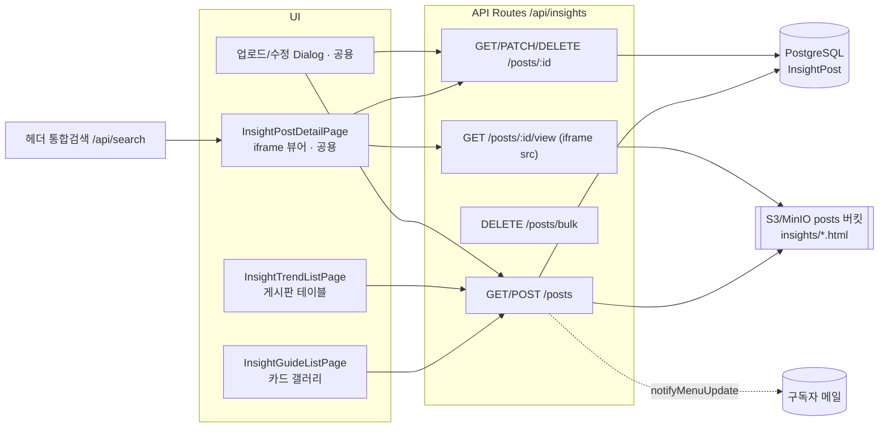

# INSIGHTS 카테고리 구현 계획 (AI 사용가이드 · 최신 동향)

> **개요:** 사이드바 LABs 바로 아래에 **INSIGHTS** 섹션을 신설하고, 두 개의 메뉴 페이지 **「AI 사용가이드」**(카드 갤러리)와 **「최신 동향」**(게시판)을 추가합니다. 두 페이지 모두 **자기완결형 HTML 문서**를 **오브젝트 스토리지(S3/MinIO)** 에 저장하고, 상세 화면에서 **iframe**으로 표시합니다. 두 페이지 모두 **메뉴 구독** 대상이며, **검색은 페이지 내 검색 없이 헤더 통합검색으로 대체**합니다.
>
> **결정 사항(사용자 확정):** ① HTML = 단일 자기완결형 `.html` ② 데이터 모델 = 전용 모델 `InsightPost` 단일(태그 모델 없음) ③ 「최신 동향」도 구독자 알림 포함 ④ **태그 기능 전면 제거** ⑤ **페이지 내 검색 제거 → 헤더 통합검색 사용**.

---

## 1. HTML 저장 방식 검토 및 제안 (DB vs Storage)

요구사항의 핵심 질문에 대한 결론입니다.

| 항목 | DB(TEXT 컬럼) 저장 | **Storage 저장 (제안·채택)** |
|------|------|------|
| 문서 크기 | 대형 HTML은 row 비대 → 목록 쿼리·백업 부담 | 메타데이터만 DB, 본문은 객체로 분리 |
| iframe 렌더링 | `dangerouslySetInnerHTML` 또는 blob 변환 필요 → **앱 DOM/스타일 충돌 위험** | URL을 iframe `src`로 직접 지정 → **문서 격리(스타일/스크립트 충돌 없음)** |
| 캐싱 | 매 조회 시 DB 왕복 | 객체 스토리지/CDN 캐시 활용 |
| 기존 관례 | eDM `htmlCode`만 DB(TEXT). 단, eDM은 생성형이라 예외 | 이미지/파일 전량 S3 저장이 앱 표준 |

**제안:** HTML 본문은 **S3/MinIO(posts 버킷)** 에 `text/html`로 저장하고, DB에는 **제목·설명·문서 URL·파일명·크기**만 기록합니다. 이는 이미 존재하는 `uploadFile(buffer, key, contentType)` 경로가 그대로 지원하며(현재 HTML 업로드 사례는 없어 이 기능이 최초), Penta Design System 페이지가 iframe으로 자기완결 문서를 “있는 그대로” 렌더링하는 이유(스타일 충돌 회피)와도 일치합니다.

**포맷 제약(확정):** 업로드 문서는 **이미지/CSS/JS가 모두 인라인된 단일 `.html`** 여야 합니다. 외부 상대경로 자산은 로드되지 않습니다(단일 객체만 업로드). 업로드 폼에 이 제약을 안내합니다.

---

## 2. 아키텍처 요약



- **라우팅:** 기존 `[slug]` 스위치 패턴을 그대로 사용. `pageType` = `insights-guide`(카드) / `insights-trend`(게시판). 상세는 `[slug]/[id]` 스위치에 두 case 추가(둘 다 **공용 iframe 상세**).
- **사이드바:** `CategoryType.INSIGHTS` enum 신설 → `categoryOrder`에서 `ETC`(LABs) 바로 뒤에 배치 → 일반 섹션 렌더러가 자동으로 “INSIGHTS” 라벨 + 2개 메뉴를 출력(하드코딩 불필요).
- **검색:** 페이지 내 검색 없음. 기존 헤더 통합검색이 두 페이지 게시물을 제목 기준으로 검색(§7).
- **권한:** 조회 = **로그인 사용자 전원**(`requireAuth`). 업로드/수정/삭제 = **ADMIN만**(`requireAdmin`).

---

## 3. 데이터 모델 (Prisma)

전용 모델을 신설합니다. 두 페이지는 **콘텐츠 형태가 동일**(제목 + 선택적 설명 + HTML 문서)하므로 **단일 공용 모델 `InsightPost`** 로 통합하고 `categoryId`로 페이지를 구분합니다. **태그 관련 모델은 없습니다.**

### 신규 enum

```prisma
enum CategoryType {
  WORK
  SOURCE
  TEMPLATE
  BROCHURE
  INSIGHTS   // ← 신설 (사이드바 INSIGHTS 섹션)
  ADMIN
  ETC
}
```

> enum 내 위치는 사이드바 순서와 무관합니다(사이드바는 `categoryOrder` 배열로 정렬). 단, 신규 enum 값 추가는 마이그레이션이 필요합니다.

### 신규 모델 (`HardwareProduct` 형태 참고)

```prisma
model InsightPost {
  id           String   @id @default(cuid())
  categoryId   String   // 어느 메뉴(guide/trend)에 속하는지 (구독·라우팅·목록·검색)
  title        String
  description  String?  // AI 사용가이드 카드의 간단한 설명 (최신 동향은 미사용)
  htmlUrl      String   // S3 posts 버킷의 text/html 객체 URL
  htmlFileName String   // 원본 파일명
  htmlFileSize Int      // bytes
  thumbnailUrl String?  // 카드용 썸네일 (선택; 없으면 플레이스홀더)
  viewCount    Int      @default(0)

  authorId    String
  author      User    @relation("InsightPostAuthor", fields: [authorId], references: [id])
  updatedById String?
  updatedBy   User?   @relation("InsightPostUpdater", fields: [updatedById], references: [id])

  category Category @relation(fields: [categoryId], references: [id])

  createdAt DateTime @default(now())
  updatedAt DateTime @updatedAt

  @@index([categoryId, createdAt])
  @@map("insight_posts")
}
```

**관계 필드 추가:**
- `Category` 모델 → `insightPosts InsightPost[]`
- `User` 모델 → `insightPosts InsightPost[] @relation("InsightPostAuthor")`, `updatedInsightPosts InsightPost[] @relation("InsightPostUpdater")`

### 시드 (`prisma/seed.ts`)

**카테고리 2건만** 추가(기존 `categories` 배열에 추가). 태그 시드 없음.

```ts
{ name: 'AI 사용가이드', slug: 'ai-guide',      type: CategoryType.INSIGHTS, pageType: 'insights-guide', order: 1, description: 'AI 활용에 도움이 되는 가이드 모음' },
{ name: '최신 동향',     slug: 'latest-trends', type: CategoryType.INSIGHTS, pageType: 'insights-trend', order: 2, description: 'AI 관련 최신 동향 공유 게시판' },
```

---

## 4. 사이드바 & 라우팅 변경

### 사이드바 (`components/category-pages/layout/Sidebar.tsx`)

1. `categoryOrder` 배열(현 239–246행)에 `CategoryType.INSIGHTS`를 **`ETC` 뒤, `ADMIN` 앞**에 삽입.
   ```ts
   const categoryOrder = [
     CategoryType.WORK,
     CategoryType.SOURCE,
     CategoryType.TEMPLATE,
     CategoryType.BROCHURE,
     CategoryType.ETC,       // LABs
     CategoryType.INSIGHTS,  // ← 신설 (LABs 바로 다음)
     CategoryType.ADMIN,
   ]
   ```
   > 요구사항 “INSIGHTS는 LABS 다음”을 이 한 줄이 결정합니다.
2. `getCategoryLabel`(220–237행)에 `case CategoryType.INSIGHTS: return 'INSIGHTS'` 추가.
3. **추가 코드 불필요:** `ETC`/`ADMIN`처럼 별도 하드코딩 블록을 만들지 않습니다. INSIGHTS는 DB 카테고리이므로 **일반 섹션 렌더러**(469–499행)가 “INSIGHTS” 라벨과 `/ai-guide`, `/latest-trends` 링크를 자동 렌더링합니다.

### 라우팅 스위치

- `app/(dashboard)/[slug]/page.tsx` — import 추가 후 switch에:
  ```ts
  case 'insights-guide': return <InsightGuideListPage category={category} />
  case 'insights-trend': return <InsightTrendListPage category={category} />
  ```
- `app/(dashboard)/[slug]/[id]/page.tsx` — 상세는 **공용 컴포넌트**:
  ```ts
  case 'insights-guide':
  case 'insights-trend':
    return <InsightPostDetailPage category={category} postId={params.id} />
  ```
  `generateMetadata`에도 두 pageType 분기 추가(제목 = `InsightPost.title` 조회).

---

## 5. Storage 업로드 · 서빙 설계

### 업로드 (서버 프록시 방식)

- **경로:** `POST /api/insights/posts` (multipart) — 브라우저가 폼(제목·설명·썸네일·HTML파일)을 전송, 서버가 버퍼링 후 S3 PUT.
- **검증:** 확장자 `.html`/MIME `text/html`만 허용, 크기 상한(예: **5MB**), 미허용 시 `BadRequestError`.
- **키 규칙:** posts 버킷에 `insights/{categorySlug}/{cuid}.html` (신규 버킷 env 불필요).
- **저장 함수:** 기존 `uploadFile(buffer, key, 'text/html; charset=utf-8')` 재사용 → 반환 `fileUrl`을 `htmlUrl`에 저장. `htmlFileName`(원본명), `htmlFileSize` 함께 저장.
- **썸네일(선택, guide 전용):** 이미지면 기존 `uploadImageWithThumbnail` 경로로 posts 버킷에 저장 → `thumbnailUrl`.

### 서빙 (iframe 소스)

- **뷰어 라우트:** `GET /api/insights/posts/[id]/view` — `requireAuth` 후 스토리지에서 HTML을 읽어 `Content-Type: text/html; charset=utf-8`, 캐시 헤더와 함께 **그대로 스트리밍**(`app/api/posts/images/route.ts` 패턴 참고). iframe `src`가 이 라우트를 가리킵니다.
- **선택 이유:** ① 로그인 사용자만 조회(내부 문서 보호) ② content-type 확실 ③ 원본 버킷 URL 비노출.
- **iframe 보안:** 관리자 업로드(반신뢰) 콘텐츠이므로 `sandbox="allow-scripts allow-popups"` 부여(문서 자체 스크립트/스타일 동작 허용, 부모 DOM 접근 차단). **본문 sanitize 없음**(자기완결 문서 보존, Penta Design System과 동일 철학). 향후 비관리자 업로드를 허용하면 `isomorphic-dompurify`로 sanitize 옵션 추가.

---

## 6. REST API 설계 (`app/api/insights/*`, `withRouteHandler`)

| 메서드/경로 | 권한 | 설명 |
|---|---|---|
| `GET /api/insights/posts` | requireAuth | 쿼리 `categoryId`(또는 `pageType`), `page`/`limit`. **페이지 내 검색(`q`) 없음.** guide는 무한스크롤·trend는 페이지네이션. 응답 `{ items, total, page, pageSize }`, `orderBy createdAt desc`. |
| `POST /api/insights/posts` | requireAdmin | multipart 업로드(§5). 생성 후 `if (isSubscribableCategory(category)) await notifyMenuUpdate({ categoryId, action:'created', title, slug, postId })`. |
| `GET /api/insights/posts/[id]` | requireAuth | 단건(author 포함). |
| `PATCH /api/insights/posts/[id]` | requireAdmin | 제목·설명·(선택)HTML 교체. HTML 교체 시 기존 객체 삭제 후 재업로드. 성공 시 `notifyMenuUpdate action:'updated'`. |
| `DELETE /api/insights/posts/[id]` | requireAdmin | DB 삭제 + S3 객체 삭제. |
| `DELETE /api/insights/posts/bulk` | requireAdmin | `{ ids }` (최신 동향 일괄 삭제용). |
| `GET /api/insights/posts/[id]/view` | requireAuth | iframe용 HTML 스트리밍(§5). |

- **검증:** `zod`. 서버·클라이언트 스키마는 `lib/insights-schemas.ts`로 **중앙화**(디자인 의뢰가 3곳 중복이던 점 개선). **태그 관련 필드 없음.**
- **구독 판별 확장:** `lib/categories.ts`의 `SUBSCRIBABLE_TYPES`에 `CategoryType.INSIGHTS` 추가 → 두 카테고리 모두 구독 가능.

---

## 7. 헤더 통합검색 편입 (페이지 내 검색 대체)

페이지별 검색 입력을 만들지 않고, **기존 헤더 통합검색**(`components/category-pages/layout/Header.tsx` → `/api/search`)이 INSIGHTS 게시물을 찾도록 편입합니다. 통합검색은 **제목 `contains` 기준**의 모델별 하드코딩 유니온이므로 블록을 추가해야 합니다.

- **`app/api/search/route.ts`:**
  1. `SearchResult.resourceType` 유니온(26–43행)에 `'insight'` 추가.
  2. **Post 블록(128–176행) 패턴을 그대로 따라** `prisma.insightPost.findMany` 블록 추가 — `title: { contains: q, mode: 'insensitive' }` + `createdAt` 범위 필터, `include: { category: { select: { slug, name, pageType, type } } }`. 각 결과에 `resourceType: 'insight'`, 카테고리 `name`/`slug`, 그리고 **행의 `category.pageType`**(`insights-guide`/`insights-trend`)을 `pageType`으로 세팅.
     > InsightPost가 자체 `categoryId` 관계를 가지므로, HW/디자인의뢰가 쓰는 aux-category 맵 방식이 아니라 **Post 방식**(행의 카테고리 관계 사용)이 적합합니다.
- **`lib/search-navigation.ts`:** `getViewUrl`에 `case 'insight': return \`/${result.slug}/${result.id}\`` 추가(hardware 케이스 미러) → 상세 iframe으로 이동.
- **카테고리 필터 드롭다운:** 코드 변경 불필요. 두 카테고리가 존재하면 `categories` prop 기반으로 자동 노출.

> 참고: 통합검색은 **제목만** 검색합니다(설명 본문 미검색). 이는 앱 전체 통합검색의 기존 동작과 동일합니다.

---

## 8. UI 구현

### 8-1. 「AI 사용가이드」 — 카드 갤러리 (`app/_category-pages/insights-guide/`)

- **레이아웃:** `HardwareListPage` 마소너리(masonry) 그대로 차용 — **카드 폭 320px**, 24px gap, `masonry-container`/`masonry-column` + `<Flipper>`. 헤더/구독/추가 버튼은 `GenericListPage` 헤더 패턴.
- **카드(`InsightGuideCard`):** `HardwareCard` 치수 복제 — 폭 320, 상단 이미지 박스 200px(`object-contain`, 썸네일 없으면 플레이스홀더), 하단 `px-4 py-3 border-t` 풋터에 **제목 + 간단한 설명**. **태그 뱃지·태그 필터 토글 없음.**
- **구독:** 헤더에 `<SubscribeButton categoryId={category.id} />`.
- **상세 이동:** 카드 클릭 → `/${slug}/${id}` → 공용 iframe 상세(§8-3).

### 8-2. 「최신 동향」 — 게시판 (`app/_category-pages/insights-trend/`)

- **테이블:** `DesignRequestListPage` 구조 차용(shadcn `Table`). **컬럼:** 체크박스(ADMIN), **No.**(`total-(page-1)*size-index`), **제목**(링크 → 상세), **게시일**(`createdAt`, `ko-KR`). 페이지네이션(10/20/50)·관리자 일괄 삭제. **태그 컬럼·페이지 내 검색 입력 없음.**
- **글쓰기/수정 Dialog:** 제목, **HTML 문서 첨부**(단일 `.html`). (설명 필드는 guide 전용이라 여기선 생략 또는 선택)
- **구독:** 헤더에 `<SubscribeButton />` (사용자 확정: 구독자 알림 포함).
- **상세:** 제목 링크 → `/${slug}/${id}` → **공용 iframe 상세**(요구사항: AI 사용가이드와 동일하게 iframe 표시).

### 8-3. 공용 상세 뷰어 (`InsightPostDetailPage`)

- 상단: 뒤로가기 · 제목 · (ADMIN) **수정/삭제** 버튼(공용 Dialog 재사용).
- 본문: `<iframe src={`/api/insights/posts/${id}/view`} sandbox="allow-scripts allow-popups" className="w-full border-0" />`. 높이는 헤더 제외 영역을 채우는 컨테이너(`h-[calc(100vh-…)]` 또는 flex-1). Penta Design System iframe 렌더링 참고.
- 조회 시 `viewCount` 증가(선택).

### 8-4. 업로드/수정 Dialog (공용, `components/insights/`)

- `react-hook-form` + `zod`(`lib/insights-schemas.ts`).
- 필드: 제목 · (guide)설명 · (guide)썸네일 업로드 · **HTML 파일 업로드**(단일 `.html`, “이미지/CSS/JS가 인라인된 자기완결 문서만” 안내). **태그 선택 없음.**
- 수정 모드: HTML 미교체 시 기존 유지, 교체 시 새 파일만.

---

## 9. 구독 · 이메일 알림

- **버튼:** 두 페이지 모두 `SubscribeButton`(전역 토글 `menuSubscriptionEnabled` 및 로그인 시에만 노출).
- **구독 가능화:** `isSubscribableCategory`가 `INSIGHTS` 타입을 포함하도록 `SUBSCRIBABLE_TYPES` 확장(§6).
- **알림 발송:** 신규/수정 시 `POST/PATCH /api/insights/posts`에서 **기존 `notifyMenuUpdate`** 재사용(posts/hardware와 동일 패턴). 별도 메일 인프라 구축 불필요 — 링크는 `${origin}/${slug}/${postId}`. SMTP(`GMAIL_USER`/`GMAIL_APP_PASSWORD`) 미설정 시 자동 무시.

---

## 10. 구현 순서

사실상 **단일 Phase(기능 완성)** 로 진행합니다.

1. Prisma: `INSIGHTS` enum, `InsightPost` 모델, 관계 필드 → 마이그레이션.
2. 시드: 카테고리 2건.
3. 사이드바(`categoryOrder`/`getCategoryLabel`) + 라우팅 스위치(list·detail·metadata).
4. Storage 업로드/뷰어 라우트 + API CRUD(+bulk) + `lib/insights-schemas.ts`.
5. `isSubscribableCategory` 확장 + `notifyMenuUpdate` 연결.
6. UI: guide 카드 갤러리(구독) + trend 게시판(테이블·첨부·구독) + 공용 iframe 상세 + 공용 업로드/수정 Dialog.
7. 헤더 통합검색 편입(`/api/search` 블록 + `getViewUrl` case).

**선택 개선(후순위):** 조회수 정렬, 카드 정렬 옵션 등.

---

## 11. 마이그레이션 · 배포 참고

- 개발 DB에 `prisma migrate dev` 적용 후, 운영은 `prisma migrate deploy`. **운영 DB에는 신규 카테고리 2건이 없으므로 시드 또는 수동 삽입 필요.**
- ⚠️ **Shadow DB 주의:** `migrate diff/dev` 시 실제 DB를 `--shadow-database-url`로 지정 금지(리셋됨). 개발 DB는 일회성으로 취급, 필요 시 `migrate reset` + seed로 복구.
- 배포 대상 브랜치는 운영 규칙에 따름(`origin/2026-06-17-tiper`).
- S3 신규 env 불필요(posts 버킷 `insights/` prefix 재사용).

---

## 12. 구현 시 참고 파일

| 용도 | 파일 |
|------|------|
| 카드 치수·마소너리 | `components/category-pages/HardwareCategory/HardwareCard.tsx`, `app/_category-pages/hardware/HardwareListPage.tsx` |
| 게시판 테이블·폼·상세·bulk | `app/_category-pages/design-request/*`, `app/api/design-requests/*`, `components/design-request/DesignRequestFormDialog.tsx` |
| iframe 상세 | `app/(dashboard)/penta-design-system/page.tsx`, `components/category-pages/layout/MainLayout.tsx`(full-bleed 분기) |
| 구독 | `components/category-pages/SubscribeButton.tsx`, `app/api/subscriptions/route.ts`, `lib/categories.ts` |
| 통합검색 | `app/api/search/route.ts`(Post 블록 128–176행), `lib/search-navigation.ts`, `components/category-pages/layout/Header.tsx` |
| 메일 | `lib/mail/menu-subscription-notification.ts`(`notifyMenuUpdate`) |
| 스토리지 | `lib/b2.ts`(`uploadFile`), `lib/s3/post-storage.ts`, `app/api/posts/images/route.ts`(프록시 패턴) |
| 권한 | `lib/auth-helpers.ts`(`requireAuth`/`requireAdmin`), `lib/api/with-route-handler.ts` |

---

## 13. 확정 정책

1. **HTML:** 단일 자기완결형 `.html`만 업로드. S3 posts 버킷 `insights/` prefix에 `text/html` 저장, iframe 뷰어 라우트로 서빙.
2. **데이터 모델:** 전용 모델 `InsightPost` **단일**(태그 모델 없음). 페이지 구분은 `categoryId`.
3. **권한:** 조회 = 로그인 전원, 생성/수정/삭제 = ADMIN.
4. **구독:** 두 페이지 모두 구독 대상. 신규/수정 시 구독자 메일 알림(`notifyMenuUpdate` 재사용).
5. **태그:** 사용 안 함(전면 제거).
6. **검색:** 페이지 내 검색 없음. 헤더 통합검색이 제목 기준으로 두 페이지 게시물 검색.
