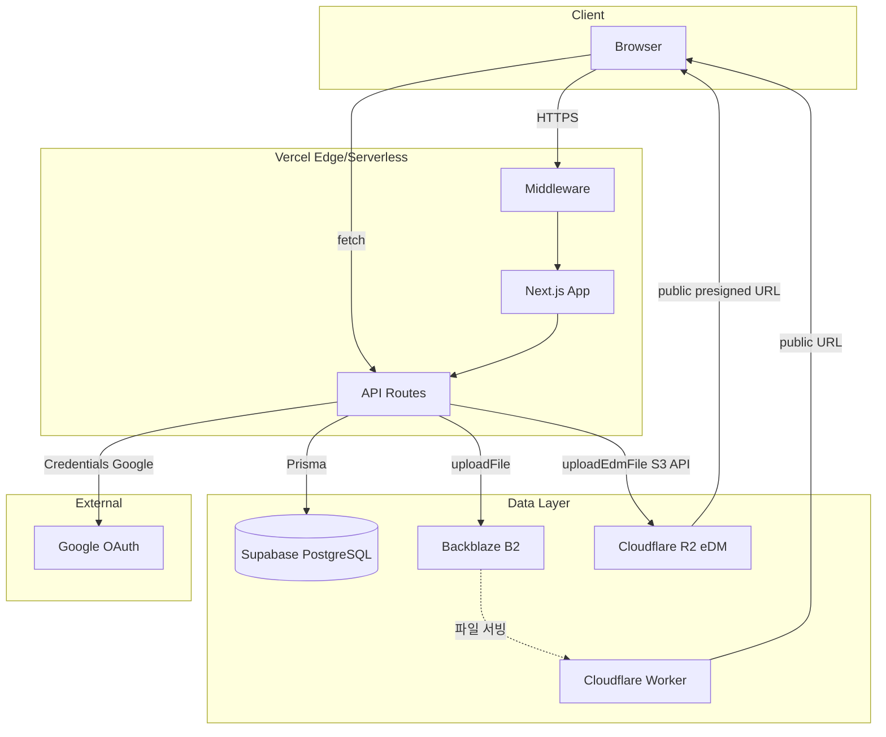

# 시스템 아키텍처 다이어그램

전체 시스템 구성요소와 클라이언트-서버-DB 관계를 한눈에 파악할 수 있는 문서입니다.

## 아키텍처 개요

## 레이어별 역할

### Client (클라이언트)

- **Browser**: 사용자가 접속하는 웹 브라우저
- React 기반 Next.js 클라이언트 컴포넌트로 UI 렌더링
- API 호출 시 쿠키(세션) 자동 전송

### Vercel / Next.js (애플리케이션)

| 구성요소 | 역할 |
|----------|------|
| **Middleware** | 경로별 인증 체크 (`/admin` → ADMIN 역할 확인) |
| **Next.js App** | App Router, SSR/SSG, 페이지 라우팅 |
| **API Routes** | REST API 핸들러 (인증, CRUD, 업로드 등) |

### Data Layer (데이터 레이어)

| 구성요소 | 용도 | 접근 방식 |
|----------|------|------------|
| **Supabase PostgreSQL** | 사용자, 게시물, 카테고리, 다이어그램, eDM 등 메타데이터 | Prisma ORM |
| **Backblaze B2** | 게시물 이미지, 다이어그램 썸네일, PPT ZIP, 가이드 영상 등. Private 버킷 시 Cloudflare Worker(예: assets.layerary.com)로 공개 URL 제공 | B2 SDK. `lib/b2.ts`, `lib/b2-client-url.ts` 참조 |
| **Cloudflare R2** | eDM 셀 이미지·썸네일 (이메일 HTML에서 직접 참조, S3 호환 API) | `lib/r2-edm-storage.ts` (AWS SDK S3 클라이언트) |

### External (외부 서비스)

- **Google OAuth**: 선택 사항. Google 계정 로그인 시 사용

### GitHub Actions (자동화)

| 기능 | 설명 |
|------|------|
| **Supabase Keepalive** | 3일마다 `{APP_URL}/api/keepalive` 호출로 Supabase 비활동 방지(무료 플랜 7일 일시정지 방지). `.github/workflows/keepalive.yml` |
| **Backup Supabase to B2** | (레거시) 클라우드 전제. 사내망은 `pg_dump` + MinIO/디스크 백업으로 대체 권장. `.github/workflows/backup-supabase-to-b2.yml` |

## 주요 라이브러리 / 연결

- **Prisma**: PostgreSQL ORM, `DATABASE_URL`(사내 Postgres 또는 호스티드 DB)
- **NextAuth**: 세션(JWT), Credentials Provider, Google Provider
- **@aws-sdk/client-s3, @aws-sdk/s3-request-presigner**: MinIO·S3 호환 스토리지 — 게시물(`lib/b2.ts`·`lib/s3/*`), eDM(`lib/r2-edm-storage.ts`), Presigned PUT

## CDN·정적·이미지

Vercel 배포 시 Edge Network로 정적 에셋과 `next/image`가 제공될 수 있습니다. 사내망 자체 호스팅 시에는 Nginx 등 앞단 캐시를 검토합니다. 객체 파일은 `S3_PUBLIC_BASE_URL` / `R2_PUBLIC_URL` 등으로 브라우저에 노출되는 URL을 맞춥니다.
