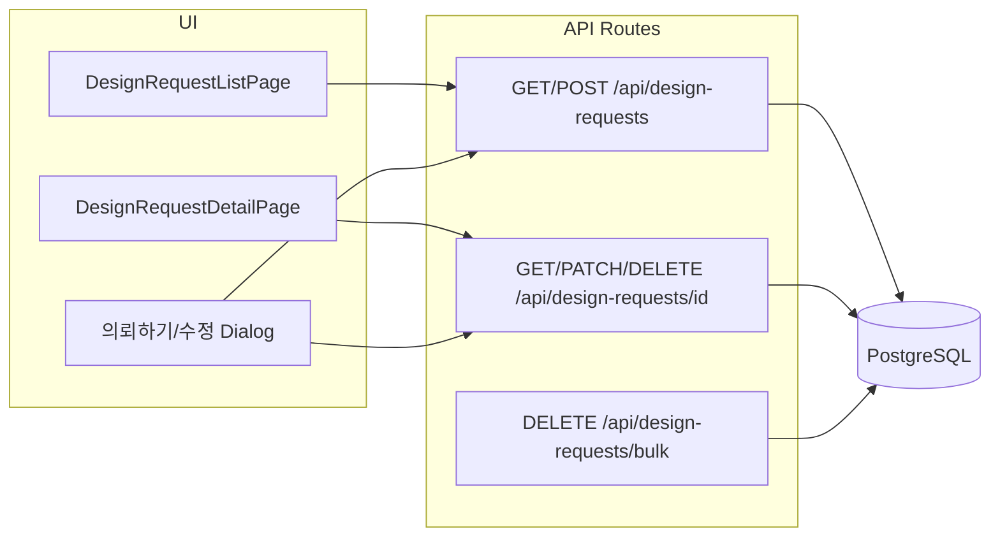

# 디자인 의뢰 게시판 구현 계획

> **개요:** Prisma에 의뢰 전용 모델을 추가하고, WORK 카테고리에 `pageType: design-request` 행을 시드한 뒤 기존 `[slug]` 라우팅에 목록·상세를 연결합니다. API(zod·권한)와 테이블 UI(검색·필터·페이지네이션·관리자 일괄삭제)를 구현하고, 이메일(Resend + React Email)은 2단계로 분리합니다.  
> **요구 사항 원문:** [`design_resources/디자인의뢰.md`](../design_resources/디자인의뢰.md)

---

## 아키텍처 요약

- **라우팅:** 기존 패턴과 동일하게 **카테고리 `slug` + `pageType`** 으로 분기 (`app/(dashboard)/[slug]/page.tsx`, `app/(dashboard)/[slug]/[id]/page.tsx`)에 `case 'design-request'` 추가.
- **사이드바 위치:** `prisma/seed.ts`에 WORK 카테고리로 **「디자인 의뢰」** 행 추가 — `order: 2`, `pageType: 'design-request'`, `slug: 'design-request'` (기존 Penta Design `order: 1` 바로 아래). `getCategories()`가 트리/정렬을 유지하므로 메뉴 순서가 요구사항과 맞음.
- **인증:** `middleware.ts`는 대시보드 전역 로그인 강제가 아님. **목록/상세 읽기**는 **로그인한 모든 사용자** (`requireAuth`). **작성**은 로그인 사용자. **수정·삭제**는 **작성자 또는 ADMIN**만 (`lib/auth-helpers.ts`). 미로그인 시 페이지/API에서 로그인 유도.

---

## 1. 데이터 모델 (Prisma)

**신규 enum** (요구 상태값과 일치):

- `REQUESTED` — 요청 (생성 시 기본)
- `IN_PROGRESS` — 진행중
- `COMPLETED` — 완료

**신규 모델 `DesignRequest`** (필드 예시):

| 필드 | 설명 |
|------|------|
| `id` | cuid |
| `title` | 의뢰 제목 |
| `content` | 의뢰 내용 (텍스트) |
| `departmentTeam` | 의뢰 부서/팀 |
| `dueDate` | 마감일 **날짜만** (시간 불필요). PostgreSQL `DATE` 매핑: Prisma `DateTime @db.Date`. 의미·비교·표시는 **한국시간(KST) 캘린더 기준**으로 통일. |
| `status` | 위 enum, 기본 `REQUESTED` |
| `authorId` | `User` FK |
| `createdAt` / `updatedAt` | 의뢰일 표시는 **목록/상세 모두 `createdAt` 기준** (작성일=createdAt). |

**User** 모델에 `designRequests DesignRequest[]` 관계 추가.

**첨부:** 1차에서는 필드 없음 (추후 `attachments Json?` 또는 별도 테이블 마이그레이션으로 확장 가능).

마이그레이션: `prisma migrate` + 시드 업데이트.

---

## 2. REST API

- **GET `/api/design-requests`:** 쿼리 `page`, `limit`(기본 10), `q`(제목), 고급 필터 `authorName`, `departmentTeam`, `status`, `createdFrom`/`createdTo`, `dueFrom`/`dueTo`. 응답에 `items`, `total`, `page`, `pageSize`. 정렬 기본: `createdAt desc`.
- **POST `/api/design-requests`:** 본인 작성. 생성 시 `status`는 **`REQUESTED` 고정**.
- **GET `/api/design-requests/[id]`:** 단건 — **모든 로그인 사용자** 조회 가능 (`requireAuth`).
- **PATCH `/api/design-requests/[id]`:** **작성자 또는 ADMIN**만. 수정 가능 필드: 제목, 부서/팀, 마감일, 내용, **상태**(요청/진행중/완료).
- **DELETE `/api/design-requests/[id]`:** 작성자 또는 ADMIN.
- **DELETE `/api/design-requests/bulk`:** body `{ ids }` — **ADMIN만**.

검증: `zod` (`app/api/posts/route.ts` 패턴).

---

## 3. UI 구성

### 목록 — `DesignRequestListPage`

- 위치: `app/_category-pages/design-request/DesignRequestListPage.tsx`
- 우측 상단 **「의뢰하기」** → **다이얼로그**
- 테이블 상단: 좌측 검색 입력(제목), 필터 아이콘 → Popover에 **의뢰자명, 부서/팀, 의뢰일 범위, 마감일 범위, 상태**
- 우측: **전체 건수**, **보기 N줄** (select: 10, 20, 50 등)
- 컬럼: 체크박스(ADMIN만), No., 의뢰 제목(링크 → `/${slug}/${id}`), 의뢰자명, 부서/팀, 의뢰일(`createdAt` 포맷), 마감일+남은일/마감 표시, 상태
- **No.:** 예: `total - (page-1)*limit - index`
- 하단: 페이지네이션 (기본 `limit=10`)
- 관리자: 선택 후 **일괄 삭제** → bulk API

### 마감일 표시 로직 (목록·상세 공통)

- 유틸: `lib/design-request-dates.ts` — KST 기준 캘린더로 남은 일수 계산, `formatDueDateLine` 등

### 상세 — `DesignRequestDetailPage`

- `[slug]/[id]/page.tsx`에서 `pageType === 'design-request'` 일 때 렌더
- 필드 표시: 제목, 의뢰자명, 부서/팀, 의뢰일(createdAt), 마감일, 상태, 내용
- **수정하기** / **삭제하기:** 작성자 또는 ADMIN만. 수정은 **글쓰기와 동일 필드**를 **다이얼로그**로 재사용

### 폼 다이얼로그 (작성·수정 공용)

- `components/design-request/DesignRequestFormDialog.tsx`
- 필드: 의뢰 제목, 의뢰자(readonly), 부서/팀, 의뢰일(readonly), 마감일(DatePicker), 의뢰 내용, 수정 시에만 **상태** Select
- `react-hook-form` + `zod`
- 읽기 전용 라벨은 `FormLabel` 대신 `Label` 사용 (FormField 컨텍스트 밖)

---

## 4. 라우팅·메타데이터

- `app/(dashboard)/[slug]/page.tsx`: `case 'design-request': return <DesignRequestListPage category={category} />`
- `app/(dashboard)/[slug]/[id]/page.tsx`: `case 'design-request': return <DesignRequestDetailPage ... />` + `generateMetadata`에서 의뢰 제목 조회

---

## 5. Phase 2 — 이메일 알림 (기본 기능 완료 후)

요구: [`design_resources/디자인의뢰.md`](../design_resources/디자인의뢰.md) 이메일 섹션.

- **트리거:** `POST /api/design-requests` 성공 직후
- **수신자:** `User.email`만 — `role === ADMIN` 전원 + 해당 글 **작성자**. 동일 주소는 중복 제거
- **스택:** Resend, `@react-email/components` (선택 `@react-email/tailwind`)
- **환경 변수:** `RESEND_API_KEY`, `RESEND_FROM`
- **전산 협조:** 발신 도메인 DNS(SPF/DKIM), 외부 발송 허용

의뢰 저장 실패 시 메일 미발송, 메일 실패 시에도 **의뢰 생성은 성공** 처리(로그만) 권장.

---

## 6. 구현 시 참고 파일

| 용도 | 파일 |
|------|------|
| 권한 | `lib/auth-helpers.ts` |
| Prisma | `lib/prisma.ts` |
| 카테고리 | `lib/categories.ts` |
| 테이블·폼 참고 | `app/(dashboard)/admin/notices/page.tsx` |

---

## 7. 확정된 정책

1. **읽기·쓰기 권한:** **모든 로그인 사용자**가 목록·상세 **읽기** 가능. **수정·삭제**는 **해당 글 작성자 또는 ADMIN**만.
2. **마감일:** **KST 기준** 날짜만 — 시각은 저장·입력하지 않음. DB는 `DATE`로 보관, 남은 일수·마감 표시는 KST 캘린더 기준.
3. **이메일 알림(Phase 2):** 수신 주소는 **`User.email`**. 관리자는 `ADMIN` 전원 + 작성자. 별도 알림용 이메일 필드 없음. Resend 발신 도메인·DNS는 전산 협조 필요.

---

## 마이그레이션·배포 참고

- 로컬/개발 DB에 마이그레이션 적용 후, **다른 환경(운영 등)** 의 DB에도 배포 시 `prisma migrate deploy` 로 동일 마이그레이션 적용.
- 운영 DB에 **카테고리 행**(`design-request`)이 없으면 시드 또는 수동으로 추가 필요할 수 있음.
