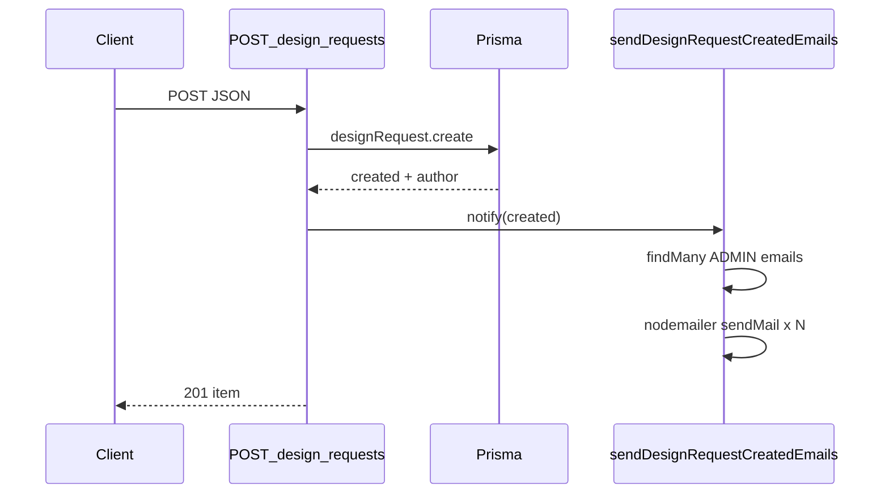

# 디자인 의뢰 알림 (Nodemailer + Gmail) 구현 계획

## 개요

디자인 의뢰 게시물이 `POST /api/design-requests`로 생성될 때 Nodemailer(Gmail SMTP)로 관리자 전원과 의뢰 작성자에게 각각(또는 중복 제거 후) 알림 메일을 발송한다. 등록 API 성공은 메일 실패와 분리해 사용자 경험을 유지한다.

## 현재 구조 (확인됨)

- **생성 진입점**: `app/api/design-requests/route.ts`의 `POST` — `prisma.designRequest.create` 후 `201`과 `{ item }` 반환.
- **의뢰자**: 세션 사용자(`requireAuth()`), 생성 시 `include: { author: { email, name, ... } }`로 이미 확보됨.
- **관리자**: Prisma `User` 모델의 `role === UserRole.ADMIN` (`prisma/schema.prisma`).
- **상세 페이지 URL 패턴**: 대시보드 `app/(dashboard)/[slug]/[id]/page.tsx` — `/{categorySlug}/{requestId}`. 시드 기준 카테고리 슬러그는 `design-request` (`prisma/seed.ts`).
- **사이트 절대 URL**: `app/layout.tsx`에서 `NEXT_PUBLIC_APP_URL` 사용(없으면 `https://layerary.com` 폴백). 메일 본문 링크는 **서버에서도 동일한 규칙**으로 origin을 만들어 일관성 유지.

## 아키텍처

- 메일 발송은 **DB 트랜잭션 성공 이후**에 호출.
- 트랜스포터/템플릿은 `lib/`에 모듈화해 API 라우트는 얇게 유지.

## 1. 의존성

- **`nodemailer`를 `dependencies`에 명시 추가** — `package.json`에 직접 선언해 런타임을 보장한다. `next-auth` 등과의 peer 호환을 위해 **7.x대** 사용을 권장한다.
- TypeScript용으로 **`@types/nodemailer`** 를 `devDependencies`에 추가(선택이지만 권장).

## 2. 환경 변수 (서버 전용)

- `GMAIL_USER`, `GMAIL_APP_PASSWORD` (Gmail 앱 비밀번호).
- 링크 생성: **`NEXT_PUBLIC_APP_URL`** (로컬/스테이징/프로덕션별로 실제 접속 가능한 origin). 레이아웃과 동일하게 trailing slash 없이 정규화해 `${origin}/${slug}/${id}` 형태로 조합.
- 카테고리 슬러그는 DB에 `pageType: 'design-request'`인 카테고리가 여러 개일 가능성을 열어두려면:
  - **권장 A**: `prisma.category.findFirst({ where: { pageType: 'design-request' }, select: { slug: true } })`로 조회해 링크에 사용 (배포마다 시드가 다를 때도 안전).
  - **대안 B**: 고정이 확실하면 env `DESIGN_REQUEST_CATEGORY_SLUG=design-request` 한 줄로만 처리 (조회 생략).

## 3. 메일 유틸 (`lib/`)

- **`getMailTransporter()`** (또는 모듈 스코프 싱글톤): `nodemailer.createTransport` with `service: 'gmail'`, `auth: { user: process.env.GMAIL_USER, pass: process.env.GMAIL_APP_PASSWORD }`.
- **`getSiteOrigin()`**: `process.env.NEXT_PUBLIC_APP_URL` 파싱 + trailing slash 제거 + 없을 때 `https://layerary.com` — `app/layout.tsx`와 동일한 정책.
- **`notifyDesignRequestCreated(created)`** (이름 예시):
  - 입력: 생성된 `DesignRequest` + `author` (이메일·이름).
  - **수신자 집합**: `prisma.user.findMany({ where: { role: ADMIN }, select: { email: true } })` + 의뢰자 `author.email`.
  - **중복 제거**: 동일 주소(예: 관리자가 본인 의뢰)는 한 번만 발송하거나, 역할별로 다른 본문이 필요하면 정책을 정함 — **단순 권장**: 주소 기준 `Set`/`Map`으로 중복 제거 후 각 주소에 **동일 템플릿** 1통(관리자/의뢰자 구분 문구가 필요하면 `isAdmin` 플래그로 분기).
  - **발송 실패 정책**: `try/catch`로 감싸고 **콘솔/로깅만** — API는 여전히 `201` 반환. (사용자는 “등록됨”, 운영은 로그로 메일 이슈 추적.) 필요 시 응답에 `mailSent: boolean` 같은 필드는 **선택** (프론트 노출 여부는 팀 정책).

## 4. 메일 본문 (스팸·품질)

- **`from`**: `'"{BRAND_EN}" <GMAIL_USER>'` 형태 — 브랜드 표기는 `lib/brand.ts`의 **`BRAND_EN`** 과 통일.
- **`subject`**: 예) `[{BRAND_EN}] 디자인 의뢰가 등록되었습니다` — 의뢰 제목 일부를 넣으면 식별에 유리 (길이 상한으로 잘라기).
- **`text`**: 필수 — 의뢰 제목, 부서/팀, 마감일(YYYY-MM-DD), **상세 보기 절대 URL** 한 줄. HTML과 동일 정보.
- **`html`**: 간단한 `
`, `<ul>` 정도로 텍스트와 동일 내용; 과도한 이미지·링크만 있는 HTML 지양.
- **선택 헤더**: `Reply-To: GMAIL_USER` (회신이 디자인 팀으로 가도록) — 동일 주소라도 명시 시 일부 클라이언트에서 유리할 수 있음.

## 5. API 통합

- 파일: `app/api/design-requests/route.ts`.
- `create` 성공 직후 `notifyDesignRequestCreated(...)` 호출.
- 환경 변수 누락 시: 개발 편의를 위해 **경고 로그 후 스킵**할지, **명시적 에러**할지 선택 — 로컬에서 `.env` 없이도 POST 테스트하려면 스킵+로그가 실무적으로 편함.
- 응답 지연을 줄이려면 `void notifyDesignRequestCreated(created)`처럼 **비동기 발송**(await 생략)을 선택할 수 있다.

## 6. 보안·운영

- `GMAIL_*`는 **서버에서만** 참조 (클라이언트 번들에 넣지 않음). `NEXT_PUBLIC_*`는 공개되므로 비밀 금지.
- 로그에 앱 비밀번호·SMTP 자격 증명 출력 금지.
- Gmail 일일 한도·계정 정지 리스크: 발송량이 적다는 전제와 맞음; 향후 증가 시 큐/전용 서비스로 이전 검토.

## 7. 검증 방법

- 로컬에서 의뢰 등록 → 관리자·본인 메일함 수신 확인.
- 관리자 계정으로 본인이 의뢰 등록 시 **중복 메일 1통**인지 확인.
- 링크 클릭 시 해당 의뢰 상세로 이동하는지 확인 (`NEXT_PUBLIC_APP_URL`이 로컬이면 `http://localhost:3000/...`).

## 산출물 요약

| 구분 | 내용 |
|------|------|
| 신규 | `lib` 하위 메일 트랜스포터 + 디자인 의뢰 알림 함수 |
| 수정 | `package.json` (nodemailer), `app/api/design-requests/route.ts` (POST 후 호출) |
| 설정 | 기존 `.env`의 `GMAIL_*` + 배포 환경의 `NEXT_PUBLIC_APP_URL` |
