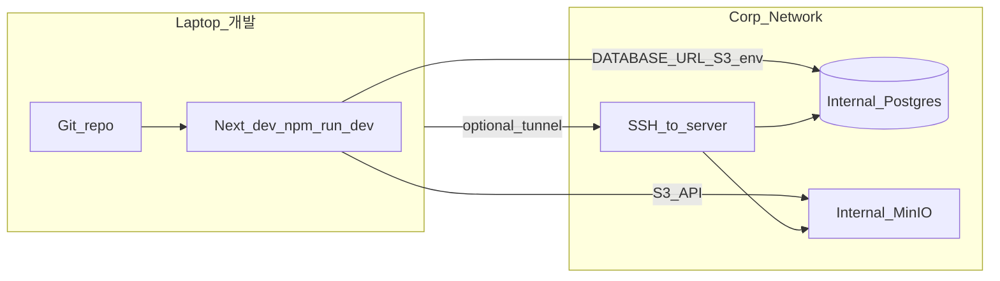
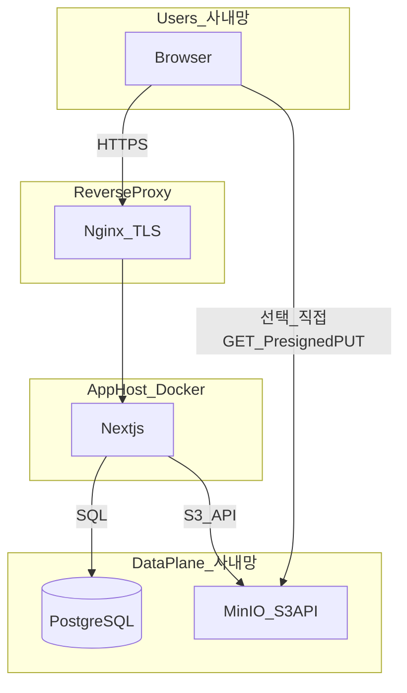

# 사내망 이전 계획 — 옵션 B (PostgreSQL + MinIO만 사용)

## 목표 및 전제

- **데이터베이스:** 사내 PostgreSQL만 사용 (Supabase 호스티드/셀프호스트 **미사용**). Prisma는 기존과 동일하게 `DATABASE_URL` / `DIRECT_URL`로 연결 ([prisma/schema.prisma](prisma/schema.prisma)).
- **객체 스토리지:** 사내 **MinIO**만 사용. **Backblaze B2, Cloudflare R2, Supabase Storage API는 모두 제거**한다는 전제로 애플리케이션과 스크립트를 정리합니다.
- **애플리케이션:** Next.js 14는 그대로 두되, 저장소 접근은 **AWS SDK S3 호환 클라이언트**(`@aws-sdk/client-s3`, `@aws-sdk/s3-request-presigner`)로 통일합니다. 이미 R2 모듈에서 해당 SDK를 사용 중입니다 ([lib/r2-edm-storage.ts](lib/r2-edm-storage.ts)).
- **작업 순서(변경):** **클라우드 소스 백업 확보 → 노트북에서 내부 DB/MinIO 기준으로 코드 수정·테스트 → 검증 후 사내 서버 프로덕션 반영·데이터 적재**를 기본으로 합니다.

---

## 로컬(노트북) 우선 개발·테스트 전략

전제: 노트북이 **회사 내부망**에 있고, 전달받은 정보로 **내부 서버 SSH**가 가능한 상태(이미 확인됨).

### 연결 방식

1. **직접 연결:** Postgres·MinIO가 사내 IP에 리슨하고, 방화벽이 노트북 대역에서 **5432·9000(예시)** 접속을 허용하면, 프로젝트 루트 `.env.local`에 내부 서버 주소를 넣고 `npm run dev`로 동일하게 개발합니다.
2. **SSH 로컬 포워딩:** DB/MinIO 포트가 노트북에 직접 안 열려 있을 때, `ssh -L 15432:127.0.0.1:5432 ...` 형태로 터널을 뚫은 뒤 `DATABASE_URL`의 호스트를 `127.0.0.1:15432`처럼 설정합니다.

### 로컬에서 할 일(권장 순서)

1. 내부 서버에 **Postgres + MinIO만** 먼저 기동(앱 컨테이너는 나중에도 됨). 버킷·CORS(로컬 오리진 `http://localhost:3000` 등)를 개발용으로 포함.
2. **빈 DB 또는 복원용 스테이징 DB**에 연결해 Prisma 마이그레이션·스키마를 맞춘 뒤, MinIO 연동 코드부터 **단계별로** `npm run dev`로 검증.
3. **Presigned 브라우저 업로드**는 브라우저가 MinIO에 직접 PUT하므로, MinIO CORS에 **로컬 앱 URL**이 들어가야 합니다.
4. 기능이 안정되면 동일 브랜치를 **내부 서버에 배포**하고, 필요 시 `NEXTAUTH_URL` 등만 프로덕션 URL로 바꿔 재검증.

### 이점

- Git·PR·리뷰가 그대로 유지되고, 사내 단일 서버에서만 편집할 때보다 **롤백·비교**가 쉽습니다.
- 내부 서버는 **데이터 플레인** 역할에 집중하고, 앱 빌드 실패나 반복 수정은 노트북에서 처리할 수 있습니다.

---

## 백업(소스 확보 및 사내 적용 시점)

### A. 컷오버·코드 전환 **이전** — 클라우드 소스 백업 (필수)

**목적:** 이전 작업 중 오류·롤백 시에도 **원본 데이터를 복구**할 수 있게 합니다. 가능하면 **읽기 전용**으로 운영 중인 서비스에 영향을 최소화하는 방식을 택합니다.

| 대상 | 권장 작업 | 비고 |
|------|-----------|------|
| **Supabase(Postgres)** | `pg_dump`(또는 Supabase 대시보드 백업)으로 **논리 덤프** 확보. 파일명에 날짜·환경 태그. | 기존 [.github/workflows/backup-supabase-to-b2.yml](.github/workflows/backup-supabase-to-b2.yml)과 동일한 `pg_dump` 접근 가능. 복원 전 **한 벌 더** 수동 백업 권장. |
| **Backblaze B2** | `b2 sync` / `rclone copy` 등으로 **버킷 전체**를 회사 정책에 맞는 저장소(암호화 디스크, 사내 NAS, 별도 백업 MinIO 등)에 복사. | 이후 MinIO로의 **이관 복사**는 이 백업본 또는 원본 중 하나를 소스로 선택. |
| **Cloudflare R2** | S3 호환 API로 `rclone`/`aws s3 sync` 등으로 버킷 복사. | eDM 버킷([lib/r2-edm-storage.ts](lib/r2-edm-storage.ts)). |
| **Supabase Storage** | `avatars` / `icons` / `ppt-thumbnails` 등 API·CLI·스크립트로 오브젝트 목록 수집 후 다운로드·아카이브. | 경로·메타데이터 일치 여부 기록. |

**검증:** 덤프 `pg_restore --list` 또는 스테이징 DB에 **테스트 복원** 한 번, 오브젝트는 **개수·용량 샘플** 비교.

### B. 이전 작업 **중** — 사내 MinIO·Postgres로의 적재

- **오브젝트:** MinIO 버킷·정책이 준비되면 **A에서 만든 백업본 또는 클라우드 원본**에서 `mc mirror` / `rclone`으로 사내 MinIO로 복제. 앱이 아직 옛 URL을 쓰는 동안에도 **미리 복제** 가능.
- **DB 덤프:** 사내 Postgres 스키마 전략(풀 덤프 vs 마이그레이션 후 데이터만)이 정해진 뒤, **로컬·스테이징에서 복원 검증** 후 프로덕션 사내 DB에 적용하는 것이 안전합니다.
- **DB 내 URL:** 앱이 MinIO·새 게이트웨이 URL을 쓰도록 준비된 뒤, **URL 일괄 치환 스크립트** 실행(반드시 스테이징에서 먼저).

### C. 이전 **이후** — 사내 운영 백업

- **Postgres:** 일일(또는 주기) `pg_dump`를 **사내 다른 디스크 또는 MinIO 백업용 버킷**에 저장. GitHub → B2 워크플로는 옵션 B에 맞게 **폐기 또는 사내 스케줄로 대체**(아래 **운영·CI/CD** 절 참고).
- **MinIO:** 버킷 레플리케이션 또는 주기적 `mc mirror`로 **보조 저장소**에 복사.
- **보존 기간·암호화·접근 권한**은 전산 정책에 따름.

---

## 목표 아키텍처

- 브라우저가 **이미지/파일 URL**로 MinIO에 직접 붙는 경우: 사내 DNS·TLS(또는 Nginx가 스토리지 경로만 리버스 프록시)로 **신뢰할 수 있는 HTTPS**를 맞추는 것이 좋습니다. 그렇지 않으면 [next.config.js](next.config.js)의 `images.remotePatterns`와 혼합 콘텐츠 이슈를 각각 조정해야 합니다.

---

## MinIO 설계(권장 검토 사항)

1. **버킷 분리 vs 단일 버킷**
   - **분리 예:** `posts`(기존 B2 담당 객체), `edms`(기존 R2), `avatars`, `icons`, `ppt-thumbnails`(기존 Supabase Storage 3종). 운영·정책·라이프사이클을 나누기 쉽습니다.
   - **단일 버킷 + 프리픽스:** 설정은 단순하나, 정책·마이그레이션 시 혼동에 유의.

2. **공개 읽기**
   - eDM 이메일 HTML·썸네일은 **만료 없는 HTTPS URL**이 필요합니다 ([lib/r2-edm-storage.ts](lib/r2-edm-storage.ts)의 `R2_PUBLIC_URL` 개념과 동일). MinIO에서는 버킷 정책 또는 **Nginx로 `/posts/` 등 경로만 익명 GET** 허용하는 패턴 중 하나를 선택합니다.

3. **CORS**
   - 기존 B2는 [scripts/setup-b2-cors.ts](scripts/setup-b2-cors.ts)로 버킷 CORS를 설정했습니다. MinIO는 **`mc admin config` / 콘솔 / S3 API**로 동일하게 **앱 오리진(사내 `NEXT_PUBLIC_APP_URL` 및 개발 시 `http://localhost:3000`)** 을 허용해야, **브라우저 → MinIO 직접 PUT(Presigned)** 이 동작합니다.

---

## 애플리케이션 변경 범위 (핵심)

### 1) B2 전용 SDK 제거 → S3/MinIO 통합 모듈

- [lib/b2.ts](lib/b2.ts): `backblaze-b2` 기반 업로드/삭제/다운로드/Presigned(`getPresignedUploadUrl`) 전부 **S3 `PutObject` / `DeleteObject` / `GetObject` / `getSignedUrl`(presign)** 로 재구현하거나, 새 파일(예: `lib/s3-storage.ts`)로 이전 후 import 경로를 유지·갈아끼기.
- 의존성: [package.json](package.json)에서 `backblaze-b2` 제거 가능.
- [types/backblaze-b2.d.ts](types/backblaze-b2.d.ts) 삭제.

### 2) Presigned **직접 업로드** 프로토콜 변경 (프론트 + API)

현재 [app/api/posts/upload-presigned/route.ts](app/api/posts/upload-presigned/route.ts)는 B2 전용 필드(`authorizationToken`, `X-Bz-File-Name` 등)를 반환하고, 아래 컴포넌트들이 동일하게 업로드합니다.

- [components/category-pages/CiBiCategory/CiBiUploadDialog.tsx](components/category-pages/CiBiCategory/CiBiUploadDialog.tsx), Character, Ppt, Wapples, Damo, Cloudbric, Isign, WelcomeBoard, Desktop, Card 등 `upload-presigned` 사용처.

**MinIO/S3 표준:** 서버는 **Presigned PUT URL**(및 필요 시 `Content-Type` 제약)만 내려주고, 클라이언트는 **`fetch(uploadUrl, { method: 'PUT', body: file, headers: { 'Content-Type': ... } })`** 형태로 호출합니다. B2용 `Authorization` / `X-Bz-File-Name` 흐름은 **전면 폐기**합니다.

- [docs/API.md](docs/API.md)의 `/api/posts/upload-presigned` 설명도 S3 기준으로 수정.

### 3) R2(eDM) 모듈 → MinIO 동일 SDK

- [lib/r2-edm-storage.ts](lib/r2-edm-storage.ts): `endpoint`를 `https://${accountId}.r2.cloudflarestorage.com` 고정에서 **환경변수**(예: `S3_ENDPOINT` 또는 `MINIO_ENDPOINT`)로 변경, `region`·`forcePathStyle: true`(MinIO 권장) 유지.
- 버킷명·퍼블릭 베이스 URL도 env로 통일해 **R2 전용 변수명(`R2_*`)을 제거하거나** MinIO 의미로 문서화.

### 4) Supabase Storage 제거

다음은 `@/lib/supabase`의 `createServerSupabaseClient()` + `storage.from(...)` 사용입니다. **동일 객체를 MinIO 해당 버킷(또는 프리픽스)에 S3 API로** 옮깁니다.

| 영역 | 파일 예시 |
|------|-----------|
| 아바타 | [app/api/profile/upload-avatar/route.ts](app/api/profile/upload-avatar/route.ts), [remove-avatar](app/api/profile/remove-avatar/route.ts), [delete-account](app/api/profile/delete-account/route.ts) |
| 아이콘 | [app/api/posts/upload-icon/route.ts](app/api/posts/upload-icon/route.ts), [posts/[id]/route.ts](app/api/posts/[id]/route.ts), [icon/download](app/api/posts/[id]/icon/download/route.ts) |
| PPT 썸네일 | [app/api/posts/upload-ppt-thumbnail/route.ts](app/api/posts/upload-ppt-thumbnail/route.ts) |
| 삭제 헬퍼 | [lib/supabase-ppt-thumbnail.ts](lib/supabase-ppt-thumbnail.ts) |

- [lib/supabase.ts](lib/supabase.ts): Storage 용도가 사라지면 **파일 삭제 또는** NextAuth 등 다른 용도가 없는지 확인 후 제거. `@supabase/supabase-js` 의존성 제거 가능 여부 점검.
- [app/api/keepalive/route.ts](app/api/keepalive/route.ts): `supabase.storage.listBuckets()` 제거. **Prisma `SELECT 1` + (선택) MinIO `ListBuckets`** 정도로 단순화.

### 5) URL 판별·프록시·이미지 최적화

- [lib/b2-client-url.ts](lib/b2-client-url.ts): `backblazeb2.com` / `B2_PUBLIC_URL` 가정을 **사내 퍼블릭 베이스 URL**(예: `NEXT_PUBLIC_OBJECT_PUBLIC_URL`) 기준으로 일반화.
- [app/_category-pages/edm/EdmEditorPage.tsx](app/_category-pages/edm/EdmEditorPage.tsx), [components/category-pages/EdmCategory/EdmCard.tsx](components/category-pages/EdmCategory/EdmCard.tsx): `supabase.co` 문자열 의존 제거.
- [next.config.js](next.config.js): `images.remotePatterns`에 MinIO/게이트웨이 호스트 추가.

### 6) 기타 코드·UI

- [app/(dashboard)/admin/dashboard/page.tsx](app/(dashboard)/admin/dashboard/page.tsx): Supabase 클라우드 대시보드 링크 **삭제 또는 사내 운영 문서 링크로 변경**.
- [scripts/migrate-b2-urls-to-worker.ts](scripts/migrate-b2-urls-to-worker.ts): 도메인/경로 규칙을 MinIO/게이트웨이 URL에 맞게 수정하거나 새 마이그레이션 스크립트 작성.

---

## 인프라 및 Rocky 서버 (Docker)

1. **docker-compose(예시 구성):** `postgres` + `minio` + `app`(Next standalone) + 선택 `nginx`.
2. **PostgreSQL:** 프로덕션 버전은 기존 클라우드 덤프와 호환되는 메이저 버전 권장 ([.github/workflows/backup-supabase-to-b2.yml](.github/workflows/backup-supabase-to-b2.yml)은 PG 17 이미지 참고).
3. **MinIO:** 영구 볼륨 마운트, 루트 자격증명은 배포 시 secret으로만 주입.
4. **Nginx:** `client_max_body_size`, 프록시 타임아웃, `X-Forwarded-Proto` — NextAuth·절대 URL 생성에 필요 ([lib/auth.ts](lib/auth.ts) `trustHost`).
5. **SELinux:** 볼륨 `:z` 등과 MinIO/Postgres 포트 허용 정책 검증.
6. **자원(4C/8GB):** Postgres + MinIO + Next 동시 상주 시 **버퍼/캐시** 튜닝 및 스왑 정책을 검토하고, 가능하면 DB 또는 MinIO만 **별 노드**로 분리하는 것이 여유롭습니다.

---

## 데이터 이전 (백업본과의 관계)

1. **PostgreSQL:** 위 절 **「A. 컷오버 전 클라우드 소스 백업」**에서 확보한 덤프를 사내 DB에 `pg_restore` / `psql`로 적용. Prisma 마이그레이션 정책에 맞게 `migrate deploy` 또는 스키마 검증. **프로덕션 적용 전** 로컬·스테이징 DB에 동일 덤프로 **한 번 복원 테스트** 권장.
2. **객체**
   - B2: `rclone`/`mc mirror` 등으로 **기존 버킷 또는 A단계 백업본** → MinIO `posts`(가칭).
   - R2: S3 호환으로 동일 복제 → `edms` 버킷.
   - Supabase Storage: 대시보드 export 또는 **S3 호환 경로가 있으면** 동일 도구, 없으면 스크립트로 버킷별 다운로드 후 MinIO 업로드.
3. **DB 내 URL 문자열:** 게시물·eDM·프로필 등에 저장된 **절대 URL**을 일괄 치환하는 SQL 또는 TS 스크립트 실행(스테이징에서 먼저 검증).

---

## 운영·CI/CD

- **Vercel 제거:** 빌드는 사내에서 `docker compose build` 또는 CI 아티팩트.
- **[.github/workflows/backup-supabase-to-b2.yml](.github/workflows/backup-supabase-to-b2.yml):** 외부 B2 업로드 의미가 없어지므로 **폐기**하고, `pg_dump` 결과를 **로컬 디스크 또는 MinIO 백업 버킷**으로 옮기는 cron으로 대체.
- **[.github/workflows/keepalive.yml](.github/workflows/keepalive.yml):** Supabase 일시정지 방지 목적이면 **불필요**. 헬스 체크만 사내 cron으로 유지 가능 ([docs/KEEPALIVE_SETUP.md](docs/KEEPALIVE_SETUP.md) 참고 후 단순화).
- **Google OAuth:** 리다이렉트 URI를 사내 `NEXTAUTH_URL`로 갱신 ([lib/auth.ts](lib/auth.ts)).

---

## 검증 체크리스트 (기능 단위)

- 이메일/비밀번호·Google 로그인, 세션
- **서버 경유 업로드** (갤러리 등 [docs/DATA_FLOW.md](docs/DATA_FLOW.md))
- **Presigned 브라우저 직접 업로드** (변경 후 PUT 방식)
- 아바타·아이콘·PPT 썸네일 (구 Supabase 경로)
- eDM 생성/수정·이메일용 이미지 URL
- 다이어그램 ZIP, 파일 다운로드, 삭제 시 스토리지 정리
- `/api/posts/images` 등 프록시·캐시 동작

---

## 문서 갱신 범위

- [docs/DEPLOYMENT.md](docs/DEPLOYMENT.md), [docs/INFRASTRUCTURE.md](docs/INFRASTRUCTURE.md): Supabase/B2/R2 섹션을 **PostgreSQL + MinIO**로 교체, **로컬 개발 연결·백업 절차** 요약 추가.
- [README.md](README.md), [env.example.txt](env.example.txt): 새 통합 env 스키마, 로컬에서 내부 서버 붙일 때 예시.
- [docs/SUPABASE_SECURITY_SETUP.md](docs/SUPABASE_SECURITY_SETUP.md): 제목/내용을 **“사내 Postgres RLS(선택)”** 등으로 이전하거나, PostgREST를 쓰지 않는 전제에서 **RLS 적용 범위**만 간단히 유지.
- [DEPLOYMENT_CHECKLIST.md](DEPLOYMENT_CHECKLIST.md): eDM 저장소·Supabase Storage 관련 **오기 정정**.

---

## 구현 순서 권장 (요약, 변동 반영)

1. **클라우드 소스 백업(A):** Postgres 덤프, B2·R2·Supabase Storage 오브젝트 확보 및 검증.  
2. **내부 서버:** Postgres·MinIO 기동, 버킷·정책·CORS(로컬+향후 프로덕션 오리진).  
3. **노트북:** `.env.local`로 내부 DB·MinIO 연결(직접 또는 SSH 터널).  
4. **코드:** 공통 S3 클라이언트 + env → R2/eDM 모듈 → `lib/b2.ts` 대체 → upload-presigned 및 클라이언트 PUT 전환 → Supabase Storage 제거.  
5. **로컬 `npm run dev`로 전 기능 스모크** 후 커밋·배포.  
6. **데이터:** MinIO로 오브젝트 복제 → 사내 DB에 덤프 복원(스테이징 선행) → DB URL 치환 → 프로덕션 전환.  
7. **사내 운영 백업(C)** 및 문서·워크플로 정리.

이 순서는 **백업 확보 → 로컬에서 내부 인프라에 붙여 코드 안정화 → 데이터 적재·컷오버**로, 앞서 논의한 “로컬 우선”과 “덤프·파일 적용 시점”을 계획 문서에 일치시킵니다.
